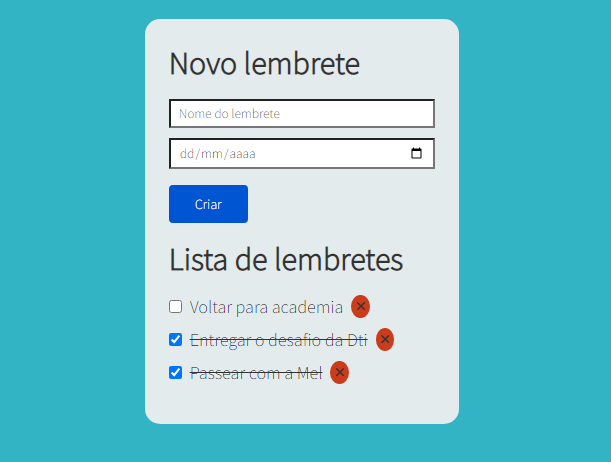

<h1 align="center"> To Do List </h1>

<h2>Esse repositório faz parte do Desafio Prático da Dti Digital. </h2></br>

O desafio é sistema de criação de lembretes (To Do List) em C# ou Java. Meu To Do List foi desenvolvido utilizando Blazor. Blazor é um framework Web baseado em HTML, CSS e C#. </br>
Para complicar o To Do List, é necessário que este respositório seja aberto em uma IDE.
No terminal da IDE digite </br>
                              ```
                              dotnet run
                              ```
</br>Caso não funcione, digite </br>
                            ```
                            cd ToDoList
                            ```
                            </br>
                            ```
                            dotnet run
                            ``` 
                            </br></br>
<div style="text-align: center">
    
</div>